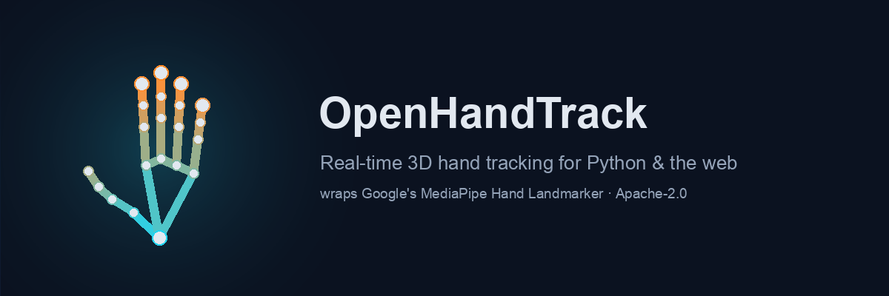

<p align="center">
  
</p>

# OpenHandTrack

**Real-time 3D hand tracking you can actually build on.**

OpenHandTrack wraps Google's [MediaPipe](https://ai.google.dev/edge/mediapipe)
Hand Landmarker task behind a clean, documented API for **Python** and the
**web**, with gesture recognition, jitter-free landmark smoothing, and example
projects that show how little code it takes. Drop it into your own projects —
no fighting MediaPipe's raw task API.

[](LICENSE)
[](https://pypi.org/project/openhandtrack/)


[](https://github.com/Xznder1984/OpenHandTracker/actions/workflows/ci.yml)
[](https://xznder1984.github.io/OpenHandTracker/)

> 📸 **Demo capture wanted.** This README is looking for a real screenshot or
> GIF of the webcam demo to drop in here — see `CONTRIBUTING.md`.

## What you get

- **21 landmarks** per hand (x, y, z), up to **2 hands**, handedness with confidence
- **Handedness done right** — the mirrored-camera quirk handled and documented
- **One-Euro smoothing** — the single feature that makes tracking feel good instead of twitchy
- **Gesture helpers** — `is_fist`, `is_open_palm`, `is_pinch`, `pointing_direction`, `count_extended_fingers`
- **Zero-friction setup** — `pip install openhandtrack` or `npm install && npm run dev`
- **Runs anywhere** — macOS, Windows, Linux; desktop or phone browser
- **Live demo** — try it instantly in your browser, no install needed

## Quickstart — Python

```bash
pip install openhandtrack
```

```python
import cv2
from openhandtrack import HandTracker

cap = cv2.VideoCapture(0)
with HandTracker() as tracker:                # model auto-downloads on first run
    while True:
        ok, frame = cap.read()
        if not ok:
            break
        result = tracker.process(frame)       # BGR frame in, clean result out
        print(len(result), "hand(s) in frame")
```

More in [`python/README.md`](python/README.md).

## Quickstart — Web

Run it locally:

```bash
cd web && npm install && npm run dev
```

Open `http://localhost:5173`, allow camera access, hold up your hand.

…or **try it live** — no install needed, works from a phone browser
(camera requires HTTPS, which Pages provides):
**[xznder1984.github.io/OpenHandTracker](https://xznder1984.github.io/OpenHandTracker/)**

Full details in [`web/README.md`](web/README.md).

## Example projects

| Example | Stack | It shows |
|---------|-------|----------|
| [Air Draw](python/examples/air_draw/) | Python | pinch to draw, palm to lift, fist to clear |
| [Volume Control](python/examples/volume_control/) | Python | thumb/index spread → system volume (cross-platform) |
| [Presentation Remote](python/examples/presentation_remote/) | Python | swipe gestures → slide navigation |
| [Virtual Piano](web/examples/virtual-piano/) | Web | fingertip + pinch → synthesized notes (Web Audio) |

## Reference

- [`docs/LANDMARKS.md`](docs/LANDMARKS.md) — all 21 landmark indices and
  anatomical names, the thing you'll look up constantly while writing gestures.
- [`python/README.md`](python/README.md) — install, hello world, API table.
- [`web/README.md`](web/README.md) — the web wrapper and demo.
- [`CONTRIBUTING.md`](CONTRIBUTING.md) — how to run tests and add an example.

## Why wrap MediaPipe at all?

The raw `HandLandmarker` API is powerful but fiddly: model files, `MpImage`
conversions, timestamps, a background thread for live mode, and a handedness
output that's silently backwards if your image isn't mirrored. OpenHandTrack
hides all of that so the *interesting* part of your project — the gesture
logic — is 10 lines instead of 100.

## License

Apache-2.0 — the same license as MediaPipe, so there are no license-conflict
surprises when you build on top of it.
